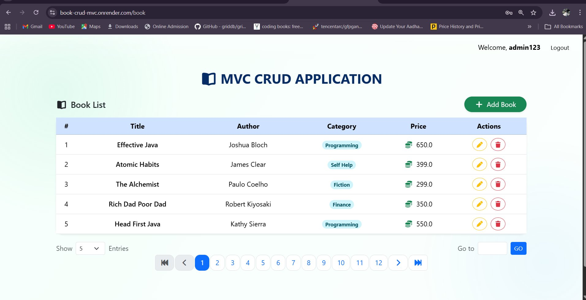
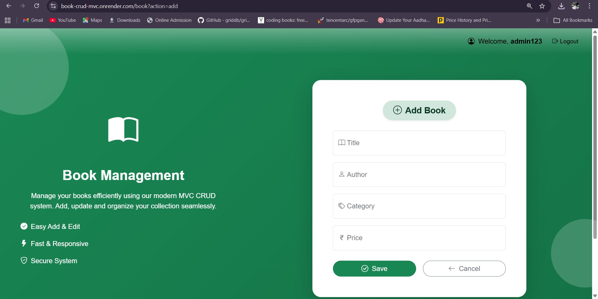
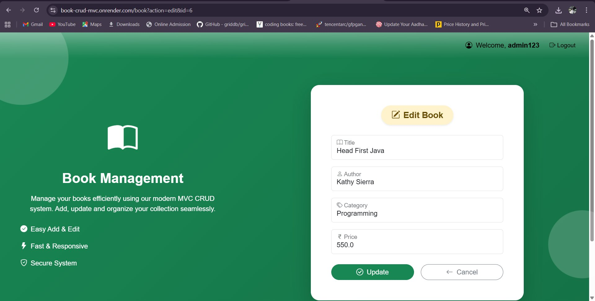

# 📚 Book CRUD MVC Application

A full-stack **Book Management Web Application** built with **Java Servlets**, **Hibernate ORM**, and **PostgreSQL**, following the **MVC (Model-View-Controller)** architectural pattern. The application includes a complete **authentication system** (login/register/logout), **paginated book listing**, and full **CRUD operations**, all containerized with **Docker**.

🌐 **Live Demo:** [book-crud-mvc.onrender.com](https://book-crud-mvc.onrender.com)

---

## 📸 Screenshots

| 🔐 Login | 📝 Register |
|:---:|:---:|
|  |  |

| 📖 Book List (Home) |
|:---:|
|  |

| ➕ Add Book | ✏️ Edit Book |
|:---:|:---:|
|  |  |

---

## ✨ Features

- 🔐 **User Authentication** — Register, Login, Logout with session management
- 🛡️ **Route Protection** — `AuthFilter` guards all `/book` routes; unauthenticated users are redirected to login
- 📖 **Book Management** — Create, Read, Update, Delete books
- 📄 **Pagination** — Configurable page size (5–100 entries) with first/prev/next/last navigation
- ✅ **Server-side Validation** — Input validation with inline error messages on the form
- ⚠️ **Centralized Error Handling** — All DAO exceptions are wrapped in `BookDAOException` and routed to a dedicated `error.jsp`
- 🔄 **Dual DAO Support** — Switchable between raw JDBC (`BookDAOImpl`) and Hibernate ORM (`BookDAOHibernateImpl`)
- 🐳 **Docker Support** — Multi-stage Dockerfile for production-ready containerized deployment
- 📱 **Responsive UI** — Bootstrap 5 with animated gradient themes and Font Awesome icons

---

## 🏗️ Architecture

This project follows a **classic Java EE MVC pattern** without a Spring dispatcher — routing is handled entirely via servlet `action` parameters.

```
Browser
  │
  ├──► AuthServlet  (/auth, /)       ← Login / Register / Logout
  │        └──► UserDAO (Hibernate)  ← users table
  │
  └──► AuthFilter  (/book)           ← Session guard
         │
         └──► BookServlet (/book)    ← List / Add / Edit / Update / Delete
                  └──► BookDAO       ← books table
                        ├── BookDAOImpl         (JDBC / PostgreSQL)
                        └── BookDAOHibernateImpl (Hibernate ORM)
```

---

## 🛠️ Tech Stack

| Layer | Technology |
|---|---|
| Language | Java 14+ |
| Web Layer | Jakarta Servlet API 6.1 |
| ORM | Hibernate ORM 7.2 |
| Database | PostgreSQL 42.7 |
| View | JSP + Bootstrap 5.3 + Font Awesome 7 |
| Build Tool | Apache Maven |
| Server | Apache Tomcat 11 (JDK 21) |
| Containerization | Docker (multi-stage build) |
| Hosting | Render.com |

---

## 📁 Project Structure

```
BOOK_CRUD_MVC/
├── Dockerfile
├── pom.xml
└── src/
    └── main/
        ├── java/com/myproject/crudapp/
        │   ├── auth/
        │   │   ├── controller/
        │   │   │   └── AuthServlet.java         # Login, Register, Logout
        │   │   ├── dao/
        │   │   │   ├── UserDAO.java             # User DAO interface
        │   │   │   └── UserDAOImpl.java         # Hibernate-based user persistence
        │   │   ├── filter/
        │   │   │   └── AuthFilter.java          # Session-based route guard
        │   │   └── model/
        │   │       └── Users.java               # @Entity: id, name, username, password
        │   ├── controller/
        │   │   └── BookServlet.java             # All book CRUD actions via ?action=
        │   ├── dao/
        │   │   ├── BookDAO.java                 # JDBC DAO interface
        │   │   ├── BookDAOImpl.java             # Raw JDBC implementation
        │   │   ├── BookDAOHibernate.java        # Hibernate DAO interface
        │   │   └── BookDAOHibernateImpl.java    # Hibernate ORM implementation
        │   ├── exception/
        │   │   └── BookDAOException.java        # Runtime exception wrapper
        │   ├── model/
        │   │   ├── Book.java                    # Book POJO: id, title, author, category, price
        │   │   └── Pagination.java              # Page/pageSize/offset helper
        │   └── utils/
        │       ├── JDBCUtils.java               # JDBC connection factory (env-aware)
        │       └── HibernateUtils.java          # Hibernate SessionFactory (env-aware)
        ├── resources/
        │   └── hibernate.cfg.xml               # Hibernate dialect & mapping config
        └── webapp/
            ├── WEB-INF/web.xml
            ├── css/app.css
            ├── includes/
            │   ├── head.jsp
            │   └── scripts.jsp
            ├── Book-list.jsp                    # Paginated book table
            ├── Book-form.jsp                    # Shared Add / Edit form
            ├── login.jsp
            ├── register.jsp
            ├── header.jsp
            ├── footer.jsp
            └── error.jsp
```

---

## ⚙️ Prerequisites

| Tool | Version |
|---|---|
| Java JDK | 14 or higher |
| Apache Maven | 3.6+ |
| Apache Tomcat | 10+ (Jakarta EE) |
| PostgreSQL | 13+ |
| Docker _(optional)_ | 20+ |

---

## 🗄️ Database Setup

### 1. Create the PostgreSQL database

```sql
CREATE DATABASE bookdb;
```

### 2. Create the required tables

```sql
-- Books table (required for JDBC DAO)
CREATE TABLE IF NOT EXISTS books (
    id       SERIAL PRIMARY KEY,
    title    VARCHAR(100) NOT NULL,
    author   VARCHAR(100) NOT NULL,
    category VARCHAR(100) NOT NULL,
    price    NUMERIC(10, 2) NOT NULL
);

-- Users table is auto-created by Hibernate (hbm2ddl.auto=update)
```

> **Note:** The `users` table is managed automatically by Hibernate on first startup. The `books` table must be created manually when using the default JDBC DAO.

---

## ▶️ Running Locally

### 1. Clone the repository

```bash
git clone https://github.com/Gauravkadam-web/BOOK_CRUD_MVC.git
cd BOOK_CRUD_MVC
```

### 2. Configure database credentials

The app reads database configuration from **environment variables** with sensible defaults:

| Variable | Default | Description |
|---|---|---|
| `DB_HOST` | `localhost` | PostgreSQL host |
| `DB_PORT` | `5432` | PostgreSQL port |
| `DB_NAME` | `bookdb` | Database name |
| `DB_USERNAME` | `postgres` | DB username |
| `DB_PASSWORD` | `1234` | DB password |

Set them in your shell before running:

```bash
export DB_HOST=localhost
export DB_PORT=5432
export DB_NAME=bookdb
export DB_USERNAME=postgres
export DB_PASSWORD=your_password
```

### 3. Build the WAR

```bash
mvn clean package -DskipTests
```

### 4. Deploy to Tomcat

```bash
cp target/BOOK_CRUD_MVC_APP.war $TOMCAT_HOME/webapps/ROOT.war
$TOMCAT_HOME/bin/startup.sh
```

Access the app at: **http://localhost:8080**

---

## 🐳 Running with Docker

The project includes a **multi-stage Dockerfile** — Stage 1 builds the WAR with Maven, Stage 2 deploys it on Tomcat 11 (JDK 21).

### Build the image

```bash
docker build -t book-crud-mvc .
```

### Run the container

```bash
docker run -d \
  -p 8080:8080 \
  -e DB_HOST=host.docker.internal \
  -e DB_PORT=5432 \
  -e DB_NAME=bookdb \
  -e DB_USERNAME=postgres \
  -e DB_PASSWORD=your_password \
  --name book-crud-mvc \
  book-crud-mvc
```

### Using Docker Compose (recommended)

Create a `docker-compose.yml` in the project root:

```yaml
version: '3.8'

services:
  db:
    image: postgres:15
    environment:
      POSTGRES_DB: bookdb
      POSTGRES_USER: postgres
      POSTGRES_PASSWORD: your_password
    ports:
      - "5432:5432"
    volumes:
      - pgdata:/var/lib/postgresql/data

  app:
    build: .
    ports:
      - "8080:8080"
    environment:
      DB_HOST: db
      DB_PORT: 5432
      DB_NAME: bookdb
      DB_USERNAME: postgres
      DB_PASSWORD: your_password
    depends_on:
      - db

volumes:
  pgdata:
```

```bash
docker-compose up --build
```

Access the app at: **http://localhost:8080**

---

## 🌐 URL Reference

### Authentication (`AuthServlet` — `/auth`, `/`)

| Method | URL | Description |
|---|---|---|
| GET | `/auth` | Show login page (default) |
| GET | `/auth?action=register` | Show registration page |
| POST | `/auth?action=doLogin` | Authenticate user |
| POST | `/auth?action=doRegister` | Register new user |
| GET | `/auth?action=logout` | Invalidate session and redirect to login |

### Book Management (`BookServlet` — `/book`) 🔐 Requires login

| Method | URL | Description |
|---|---|---|
| GET | `/book` | Paginated book list (default) |
| GET | `/book?action=add` | Show add book form |
| POST | `/book?action=insert` | Save new book |
| GET | `/book?action=edit&id={id}` | Show edit form for a book |
| POST | `/book?action=update` | Update existing book |
| GET | `/book?action=delete&id={id}` | Delete a book by ID |

### Pagination Query Parameters

| Parameter | Default | Options |
|---|---|---|
| `page` | `1` | Any valid page number |
| `pageSize` | `5` | 5, 10, 15, 20, 25, 50, 75, 100 |

---

## 📦 Data Models

### Book

| Field | Type | Validation |
|---|---|---|
| `id` | `int` | Primary key, auto-increment |
| `title` | `String` | 3–25 chars, letters and spaces only |
| `author` | `String` | 3–25 chars, letters, dots, and spaces |
| `category` | `String` | 3–25 chars, letters and spaces only |
| `price` | `Double` | Must be > 0 |

### Users

| Field | Type | Constraints |
|---|---|---|
| `id` | `int` | Primary key, auto-increment |
| `name` | `String` | Required |
| `username` | `String` | Required, unique |
| `password` | `String` | Required |

---

## 🔄 Switching Between JDBC and Hibernate DAO

The servlet supports two interchangeable DAO implementations. Edit `BookServlet.java`:

```java
// Default — raw JDBC
bookDao = new BookDAOImpl();

// To switch to Hibernate ORM:
// bookDao = new BookDAOHibernateImpl();
```

> **Note:** When using `BookDAOHibernateImpl`, uncomment the `@Entity`, `@Id`, and `@GeneratedValue` annotations in `Book.java`.

---

## 🧪 Running Tests

```bash
mvn test
```

---

## 🔒 Security Notes

> This project is a learning/portfolio application. Before deploying to production, consider these improvements:

- **Password Hashing** — Passwords are stored in plain text. Use `BCrypt` or `PBKDF2`.
- **CSRF Protection** — Add CSRF tokens to all state-changing POST forms.
- **XSS Prevention** — Add output encoding in JSPs (e.g., `<c:out value="${...}"/>`).
- **HTTPS** — Configure TLS on Tomcat or front it with an Nginx reverse proxy.
- **SQL Injection** — Already mitigated: JDBC DAO uses `PreparedStatement`; Hibernate uses parameterized HQL.

---

## 🤝 Contributing

Contributions are welcome!

1. Fork the repository
2. Create a feature branch: `git checkout -b feature/your-feature`
3. Commit your changes: `git commit -m "feat: describe your change"`
4. Push to the branch: `git push origin feature/your-feature`
5. Open a Pull Request

---

## 📄 License

This project is open-source and available under the [MIT License](LICENSE).

---

## 👤 Author

**Gaurav Kadam**
GitHub: [@Gauravkadam-web](https://github.com/Gauravkadam-web)

---

> ⭐ If you found this project helpful, please give it a star on GitHub!